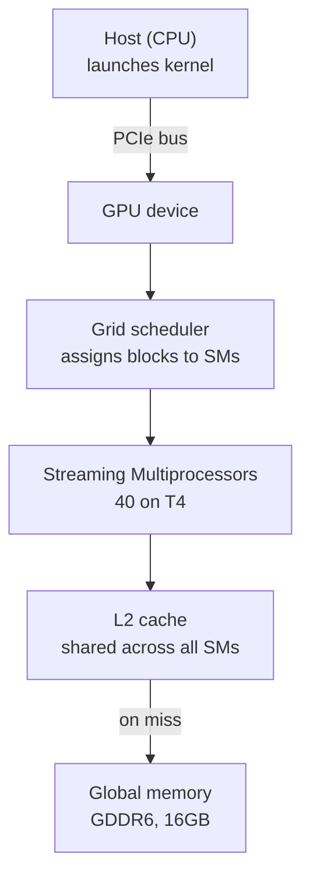
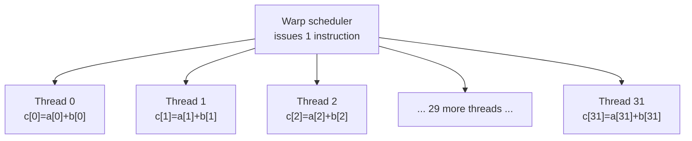
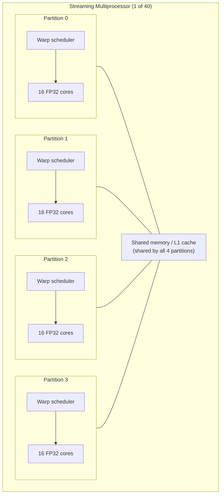
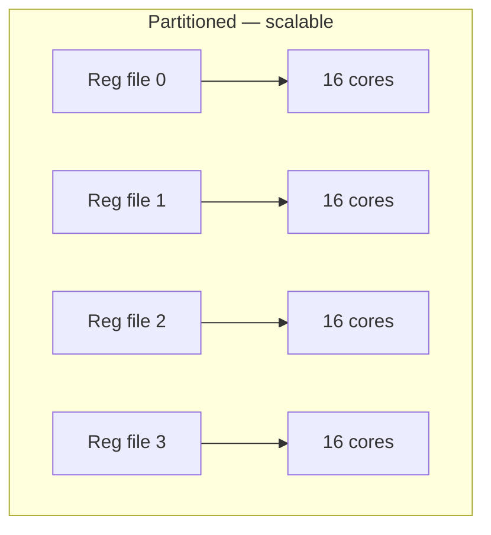
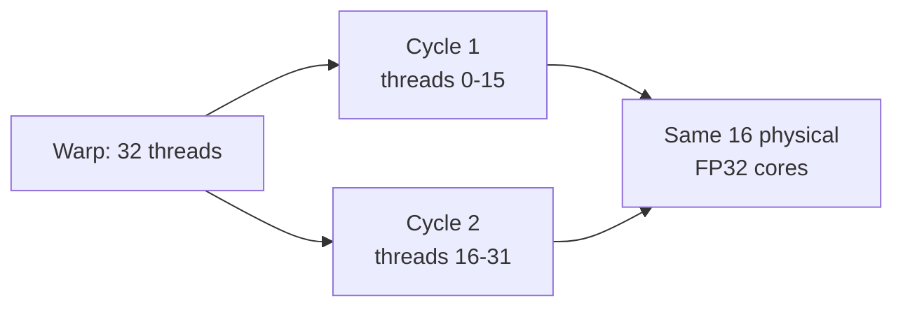
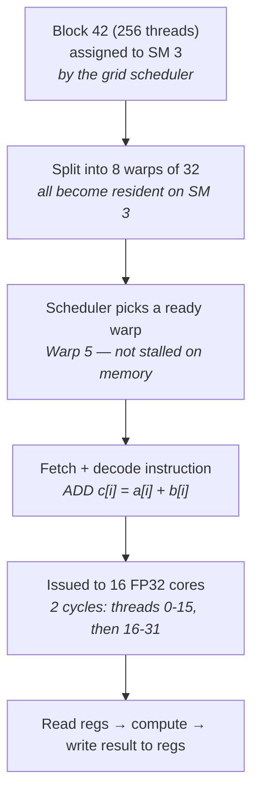
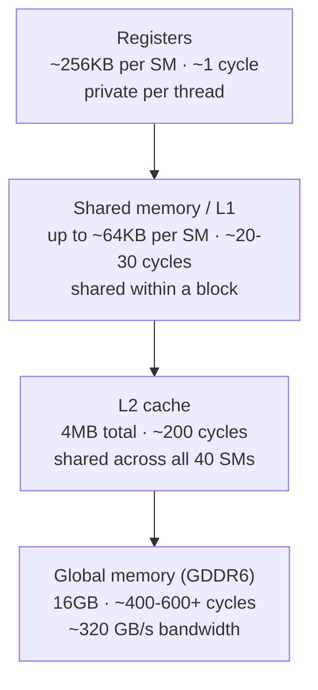
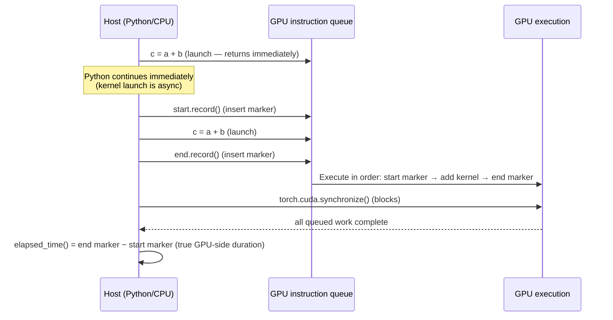
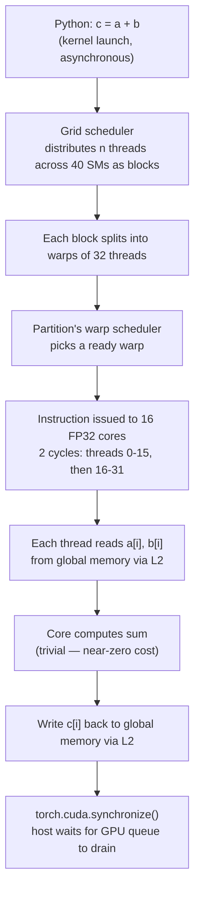

# Phase 0 — GPU & CUDA Foundations: A Complete Beginner's Guide

> **Track:** AI Infra Mastery Journey — Phase 0 (GPU/CUDA Foundations)
> **Hardware used for labs:** Azure NC-series (T4)
> **Status:** Core mental models established — not yet written CUDA code
> **Supersedes:** `phase0-lesson01-...` and `phase0-lesson02-...` (this file merges
> and reorganizes both — safe to retire the originals once you've skimmed this)

## How to use this guide

This is written to be read top to bottom the first time, then used as a
reference afterward — each section builds on the one before it. Every diagram
below is written in [Mermaid](https://mermaid.js.org/), which GitHub renders
natively from a plain ` ```mermaid ` code block, so nothing will break the way
raw SVG did. If a diagram doesn't render in whatever tool you're viewing this
in, the code block is still fully readable as plain text.

---

## 1. Why GPUs Exist: The CPU vs. GPU Mental Model

The question underneath everything: why does a GPU exist when we already had
CPUs? The answer isn't "GPUs are faster" — that's imprecise. A single GPU core
is *individually weaker* than a single CPU core. The real answer is that CPUs
and GPUs were built to win completely different bets.

A CPU spends its transistor budget minimizing the time to finish **one**
instruction stream — branch prediction, out-of-order execution, deep caches —
because it's optimized for sequential, unpredictable, dependent logic (an
operating system, a web server, a database query planner).

A GPU makes the opposite bet: it assumes you don't have one complicated task,
you have millions of simple, largely independent tasks, and it spends its
transistor budget on raw arithmetic units instead of cleverness.

| | **CPU** | **GPU** |
|---|---|---|
| Optimizes for | Latency of *one* instruction stream | Throughput across *millions* of independent tasks |
| Analogy | A small number of very smart workers, each able to handle complex, unpredictable tasks fast | A vast number of simple workers doing the *same* simple task at once, in lockstep, on different data |
| Transistor budget spent on | Branch prediction, out-of-order execution, speculative execution, deep caches | Raw arithmetic units (thousands of simple cores) |
| Good at | Sequential, branchy, dependent logic (OS, web servers, DB query planning) | Massively parallel, independent, repetitive math (matrix multiply, element-wise ops) |
| Execution model | One (or few) instruction streams, high per-instruction intelligence | **SIMT** — Single Instruction, Multiple Threads |

**Key phrase to remember:** *CPU = few smart workers. GPU = many simple
workers acting in lockstep.*

**Why this maps perfectly to deep learning:** neural network training and
inference are overwhelmingly matrix multiplications and element-wise
operations. Each individual multiply is trivial — but there are billions of
them, and critically, most are **independent** (output neuron 1 doesn't depend
on output neuron 4,000 being computed first). That independence is the entire
reason GPUs work for ML: you can spray the work across thousands of cores
simultaneously instead of grinding through it sequentially.

---

## 2. The Idea That Matters More Than Any Other: Memory-Bound vs. Compute-Bound

> **The bottleneck in almost all real GPU workloads is not "not enough compute
> cores." It's getting data to those cores fast enough to keep them fed.**

A GPU can do arithmetic at an absurd rate. But if data has to travel from
memory to the compute units slower than the cores could theoretically consume
it, the extra cores just sit idle, waiting. This is the **compute-bound vs.
memory-bound** distinction, and it's arguably the single most useful
diagnostic lens in this entire field.

**T4-specific concrete picture:**
- 2,560 CUDA cores + dedicated Tensor Cores (accelerate FP16/INT8 matrix math)
- 16GB GDDR6 memory with a *fixed bandwidth ceiling*
- If a computation needs more bytes moved per unit of useful arithmetic than
  that bandwidth allows → compute units wait → low utilization in `nvidia-smi`
  or Nsight, *even though the GPU looks "busy."*

**Why this matters for everything downstream:** nearly every optimization
technique later in this curriculum is ultimately an answer to *"how do we keep
compute units fed with data instead of waiting for it?"* — this includes why
CUDA kernels are structured the way they are, why INT8 quantization speeds up
inference (less data to move), and why TensorRT fuses layers together (fewer
memory round trips).

**Diagnostic skill being built:** looking at a workload and immediately asking
*"is this memory-bound or compute-bound?"* is a hallmark of a strong GPU
performance engineer. We'll build the tools (Nsight, `nvidia-smi`, PyTorch
profiler) to answer this concretely in later lessons.

---

## 3. The Journey of One Instruction, Top to Bottom

Everything from here on is really just zooming into different parts of this
one flow. Keep this diagram as your anchor — every later section is a deeper
look at one box in it.



| Layer | Role | Analogy |
|---|---|---|
| Host (CPU) | Launches kernel, orchestrates | The client placing an order |
| Grid scheduler | Assigns blocks to SMs | Dispatcher assigning work to factory floors |
| SM (×40 on T4) | Self-contained compute unit | One factory floor |
| L2 cache | Shared fast memory, checked first | The floor's local parts bin |
| Global memory (GDDR6) | Large but slower memory | The warehouse across the yard |

**Worked example used throughout this guide:** vector add,
`c[i] = a[i] + b[i]`, across 1 million elements. When PyTorch runs `c = a + b`
on GPU tensors, this whole flow is what actually happens underneath.

---

## 4. Inside an SM: Grid → Block → Warp → Core

### 4.1 An SM is not "one core"

A streaming multiprocessor is a self-contained mini-processor: it has its own
warp scheduler(s), its own CUDA cores, and its own fast on-chip memory
(registers + shared memory/L1). The T4 has 40 of these, together containing
the 2,560 total CUDA cores.

For our vector-add kernel, the grid is roughly 1,000 thread blocks × 1,024
threads/block — one thread per output element — and the grid scheduler
distributes those blocks across the 40 SMs.

### 4.2 SIMT: Same Instruction, Different Data

Once threads land on an SM, they're organized into **warps** — fixed groups of
exactly 32 threads. A warp scheduler issues **one instruction** that all 32
threads execute together, each against its own data. This is the literal
meaning of SIMT: **S**ingle **I**nstruction, **M**ultiple **T**hreads.



Same operation, broadcast once, 32 parallel executions — no thread waits for
another to finish before starting. Each thread figures out which array index
`i` belongs to it using its own thread ID.

> ⚠️ **Warp divergence (flag now, revisit once writing real kernels):** if an
> `if` statement inside a kernel sends some threads down the `true` branch and
> others down `false`, the hardware **cannot run both paths at once**. It
> serializes — runs the true-branch threads while the others idle, then flips.
> This silently kills performance in code that looks perfectly reasonable from
> a CPU-thinking mindset.

### 4.3 Closing the loop on memory-bound (now made physical)

Section 2 introduced compute-bound vs. memory-bound as an abstract idea. Now
it's physical: the *addition* in vector-add is computationally trivial, but
fetching `a[i]` and `b[i]` and writing `c[i]` back means a real trip — SM → L2
cache (checked first) → global memory (GDDR6) if L2 misses → back to the SM.
Multiplied across a million elements, that round trip dominates total time,
not the arithmetic. This is *why* vector-add — and many real ML ops — are
memory-bound: the distance data has to travel is the bottleneck, not the
ALU's raw capability.

---

## 5. Why SMs Are Internally Partitioned

### 5.1 The structure

On Turing (the T4's architecture), each SM is physically split into **4
partitions** (also called "processing blocks" or "sub-cores"). Each partition
is a near self-contained mini-processor with its own warp scheduler, its own
slice of the register file, and **16 FP32 cores** (plus 16 INT32 cores and a
couple of Tensor Cores).



4 partitions × 16 FP32 cores = 64 FP32 cores/SM → × 40 SMs = **2,560 CUDA
cores**, matching the T4 spec exactly — nothing was hidden earlier, just
aggregated.

### 5.2 Why build it this way instead of one big 64-core pool?

Three real engineering pressures, not an arbitrary choice:

**1. Wiring/die-area cost.** A register file feeding 64 cores from one central
point needs a huge crossbar of wires — costly in die area and power, and
longer wires mean slower signals. Splitting into four partitions means each
one only has to wire its register file to its own 16 nearby cores: a much
smaller, cheaper, faster routing problem.




Same 64 cores, same total "wiring budget" — spent as four short local hops
instead of one long hop repeated 64 times. **General pattern worth
remembering:** decentralizing into smaller independent units often scales
better than centralizing, and you'll see this exact tradeoff resurface at
every level of infrastructure, not just silicon.

**2. Scheduling throughput.** Because each partition has its *own* warp
scheduler, all four can issue an instruction to a different warp **in the same
clock cycle** — the SM makes progress on 4 warps at once, not 1. A single
SM-wide scheduler would actually be a worse bottleneck than the core-count
issue below.

**3. Latency hiding.** With only 16 physical FP32 cores per partition, a
32-wide warp's floating-point instruction can't fully retire in one cycle —
it takes two: threads 0–15 execute on cycle 1, threads 16–31 on cycle 2.



### 5.3 CUDA Core ≠ Warp — a common mix-up worth sharpening

Easy misconception: "a warp is 32 CUDA cores." Not accurate — don't conflate
them.

| | CUDA core | Warp |
|---|---|---|
| What it is | **Physical** arithmetic unit on the chip | **Logical** group of 32 threads scheduled together |
| Fixed count? | Varies per SM/partition (16 FP32 cores/partition on Turing) | Always exactly 32 threads |
| Analogy | An actual worker on the factory floor | A shift of 32 workers moving through the same task list together |

The correct way to hold this: "32 threads execute simultaneously" is the right
*logical* model — no thread in the warp lags behind in the instruction stream,
they're all lockstep. But the *physical* execution can take more than one
clock cycle, depending on how many cores the partition actually has. This gap
— between the logical 32-wide warp abstraction and the real, finite number of
physical execution lanes underneath it — is exactly what **occupancy** (a term
you'll meet constantly in performance tuning) is about. More threads
requested ≠ automatically more speed delivered.

### 5.4 Does a single CUDA core handle more than one thread at once?

**No.** A CUDA core is a **scalar unit** — at any given cycle, it does
arithmetic for exactly one thread. It doesn't internally multiplex multiple
threads the way an SM as a whole does.

All GPU parallelism comes from having *many* simple scalar cores, each working
a different thread at the same moment — not from any single core being clever
enough to multitask. Worth contrasting with a CPU core, which often *does* use
simultaneous multithreading (hyperthreading) to interleave more than one
instruction stream through itself. A CUDA core deliberately skips that kind of
cleverness — it's kept simple and scalar on purpose, because the GPU gets its
throughput from replicating thousands of simple units, not from making each
one individually smarter. This is the SIMT philosophy again, one layer
deeper: **throughput via simplicity × quantity, not complexity × cleverness.**

---

## 6. Register File ≠ Instructions — a second common mix-up

The register file does **not** hold instructions. It holds **data** — the
actual values a thread is working with: `a[i]`, `b[i]`, intermediate results,
loop counters. It's each thread's private scratch space, the fastest storage
on the entire chip, sitting right next to the cores that use it.

Instructions travel a separate path entirely: fetched from an instruction
cache, decoded, and issued by the warp scheduler to the partition's cores.

| | Register file | Instruction |
|---|---|---|
| What it is | **Data** — values a thread works with | The **operation** to perform |
| Where it lives | Fast on-chip storage, private per-thread | Instruction cache; fetched and decoded separately |
| Analogy | The workbench stocked with the exact parts a worker needs | The work order telling the worker what to do with those parts |

**Full loop for one instruction on one thread:**


**Why this makes the wiring problem from Section 5 so important:** the
register-file ↔ core connection isn't a one-time setup cost — it's exercised
on *every clock cycle, for every thread*. That's exactly why wiring distance
has a real, continuous performance and power cost, not just a one-off design
cost.

---

## 7. End-to-End Worked Example: One Instruction Through One SM

Putting all of the above together, concretely. **Setup:** kernel
`c[i] = a[i] + b[i]`, grid dispatched. Block 42, containing 256 threads, gets
assigned by the grid scheduler to SM 3.



**Step by step:**

1. **Block assignment.** Grid scheduler hands Block 42 (256 threads) to SM 3 —
   a one-time decision at dispatch; Block 42 belongs to SM 3 until it
   finishes.
2. **Split into warps.** SM 3 organizes the 256 threads into 8 warps of 32
   (256 ÷ 32 = 8). All 8 become *resident* on the SM simultaneously — their
   state (current instruction, register contents) lives on-chip at once, even
   though only a few can actually execute on any given cycle. **This is the
   seed of latency hiding**: many resident warps means the scheduler has
   options.
3. **Scheduler picks a ready warp.** Partition 0's warp scheduler picks a
   resident warp that isn't stalled waiting on memory — say, Warp 5. If Warp 5
   *were* mid-wait on a global memory load, the scheduler skips it and runs a
   different ready warp instead — this is exactly how the SM avoids idling
   during a memory stall.
4. **Fetch + decode.** Warp 5's next instruction (`ADD c[i]=a[i]+b[i]`) is
   fetched from the instruction cache and decoded: which operation, which
   registers to read, which register to write the result into.
5. **Issue to the cores.** The decoded instruction is issued to Partition 0's
   16 FP32 cores. Warp 5 has 32 threads but only 16 physical cores are
   available → 2 clock cycles: threads 0–15 execute on cycle 1, threads 16–31
   on cycle 2.
6. **Read → compute → write back.** Each involved core reads its thread's
   `a[i]`/`b[i]` from the register file (loaded there earlier by a prior
   `LOAD` instruction pulling from global memory via L2), computes the sum,
   and writes it back to that thread's register slot — ready for a later
   `STORE` to push it out to global memory as the final `c[i]`.

**Meanwhile, concurrently:** the other 3 partitions on SM 3 run this same
6-step loop independently on their own resident warps. And if Warp 5 hits an
instruction needing data that isn't loaded yet, its scheduler doesn't wait —
it switches to a different ready resident warp, runs that instead, and returns
to Warp 5 once its data has arrived. **That's latency hiding, made concrete:**
the SM stays busy not because any one warp is fast, but because it always has
other queued-up work to fall back on.

---

## 8. Consolidated Glossary

| Term | Definition |
|---|---|
| SIMT | Single Instruction, Multiple Threads — GPU execution model where many threads run the same instruction on different data simultaneously |
| Compute-bound | Performance limited by arithmetic throughput, not data movement |
| Memory-bound | Performance limited by how fast data can be moved to/from compute units, not by arithmetic capacity |
| Tensor Core | Specialized GPU hardware unit for accelerated low-precision matrix math (FP16/INT8/etc.) |
| Kernel launch | The request sent from host to GPU to execute a specific instruction sequence across a grid of threads |
| Grid | The full set of thread blocks dispatched by one kernel launch |
| Thread block | A group of threads assigned together to a single SM |
| Warp | A hardware-fixed group of 32 threads that execute in lockstep under one warp scheduler |
| Warp divergence | Performance penalty when threads in a warp take different branch paths and must be serialized |
| L2 cache | On-GPU cache shared across all SMs, checked before going to global memory |
| Partition (sub-core) | A physical subdivision of an SM with its own warp scheduler, register file slice, and set of cores |
| Occupancy | How well an SM's actual physical cores stay busy relative to its logical thread capacity |
| Register file | Fast, private, on-chip storage holding each thread's working data (not instructions) |
| SRAM | Fast, expensive-per-bit memory (registers, shared memory, L1, L2) — ~6 transistors/bit |
| DRAM | Dense, cheap-per-bit memory (global memory) — 1 transistor + 1 capacitor/bit, needs refresh |
| Arithmetic intensity | FLOPs performed ÷ bytes moved from/to memory — low values indicate memory-bound workloads |
| Roofline model | Framework (to be formalized later) for reasoning about whether a kernel is memory-bound or compute-bound based on arithmetic intensity vs. hardware limits |
| Tiling | Loading a reusable chunk of data into shared memory once so multiple threads can reuse it, instead of each re-fetching from global memory |
| Kernel launch overhead | Fixed cost to dispatch a CUDA kernel (Python → driver → GPU queue), roughly constant regardless of data size — dominates measured time at small workload sizes |
| Achieved bandwidth | Real-world bytes-moved ÷ time-taken for a kernel, vs. a GPU's theoretical peak bandwidth spec — typically 75-95% of peak depending on access pattern and problem size |

---

## 9. The GPU Memory Hierarchy: Where Data Lives, and Why It Matters

This section applies the exact same "physical distance costs you something"
logic from Section 5's register-file wiring discussion, just at a larger
scale: memory tiers aren't arbitrary — they're what you get when you trade
capacity for proximity, repeatedly, at increasing distance from the cores.

### 9.1 The tiers



*(Figures are approximate T4/Turing values for intuition-building — to be
verified against Nsight on real hardware in a later lab.)*

| Tier | Location | Capacity | Latency | Scope |
|---|---|---|---|---|
| Registers | On-chip, per-partition | ~256KB/SM (64K × 32-bit) | ~1 cycle | Private per thread |
| Shared memory / L1 | On-chip, per-SM | up to ~64KB/SM (configurable split) | ~20-30 cycles | Shared within a thread block |
| L2 cache | On-chip, chip-wide | 4MB total | ~200 cycles | Shared across all 40 SMs |
| Global memory | Off-chip (GDDR6) | 16GB | ~400-600+ cycles | Entire GPU, ~320 GB/s bandwidth |

Capacity grows roughly two orders of magnitude at each step down — and
latency grows right along with it. Not a coincidence; it's the same physics
showing up twice.

### 9.2 Why capacity and speed trade off (the physical "why")

- **Registers, shared memory, L1, L2** = **SRAM**. ~6 transistors/bit → fast,
  no refresh needed, but expensive in silicon area → only kilobytes affordable.
- **Global memory** = **DRAM**. 1 transistor + 1 capacitor/bit → far denser
  and cheaper per bit (→ gigabytes affordable), but slower (charge-sensing +
  periodic refresh) and physically **off the GPU die entirely**, across the
  package.
- Same "distance tax" as the register-file wiring argument (Section 5) — just
  now it's not only wire length inside one SM, it's whether the memory lives
  on-chip at all vs. requiring a trip off the die.

### 9.3 Making memory-bound numeric (vector-add example)

For `c[i] = a[i] + b[i]` across 1M floats:
- Read `a`: 4MB, read `b`: 4MB, write `c`: 4MB → **12MB total data movement**
- Compute: 1M additions — computationally trivial for the chip

**Arithmetic intensity** = FLOPs ÷ bytes moved ≈ 1,000,000 ÷ 12,000,000 ≈
**0.08 FLOPs/byte** — extremely low. This is the *numeric proof* that
vector-add is memory-bound, not just a conceptual claim. (This is the seed of
the **roofline model**, to be formalized later.)

**Performance floor calculation:** at T4's ~320 GB/s bandwidth, moving 12MB
takes at minimum ≈ 12,000,000 ÷ 320,000,000,000 ≈ **37.5 microseconds**. No
amount of extra cores or cleverer scheduling can beat this floor — the
bottleneck is physically how fast bytes can travel from GDDR6 to the chip.
**Expert habit worth building:** do this back-of-envelope math *before*
touching a profiler, purely to know what "good" looks like for a kernel.

### 9.4 Why shared memory exists: reuse what you already paid to fetch

If a kernel is memory-bound because it re-fetches the same data repeatedly
from global memory, the fix is: fetch once, reuse many times. This is exactly
what a well-written matrix multiply does — instead of every thread
re-reading the same rows/columns from slow global memory, a block
cooperatively loads a tile into shared memory once, and every thread in that
block reuses it many times from fast on-chip memory.

**This is the single biggest lever in CUDA performance tuning** — trading a
small amount of shared memory for a large reduction in global memory traffic,
which raises arithmetic intensity and pushes a workload from memory-bound
toward compute-bound. It's exactly what cuBLAS, cuDNN, and TensorRT do
automatically under the hood in their "optimized" kernels vs. naive ones.

### 9.5 Empirically Verified: Lab 01 Results (real T4 measurements)

The floor calculated in 9.3 was theory. Here's what running it for real on the
T4 actually showed (full details: `labs/phase0-gpu-cuda/01-vector-add-timing/`):

| n | measured (min) | predicted floor | ratio | achieved bandwidth |
|---|---|---|---|---|
| 1,000,000 | 51.97 μs | 37.50 μs | 1.39x | ~231 GB/s (~72% of peak) |
| 10,000,000 | 413.89 μs | 375.00 μs | 1.10x | ~290 GB/s (~91% of peak) |
| 100,000,000 | 4031.04 μs | 3750.00 μs | 1.07x | ~298 GB/s (~93% of peak) |

**Two new concepts this revealed, worth carrying forward:**

- **Kernel launch overhead.** Every CUDA kernel dispatch (through
  PyTorch → CUDA driver → GPU queue) carries a roughly constant fixed cost,
  independent of data size. At small `n`, this is a meaningful fraction of
  total time (1M elements: ~14 of 52 μs wasn't bandwidth-bound work at all).
  At large `n`, it's amortized into irrelevance. **Practical implication:**
  don't benchmark small workloads and expect to see hardware's advertised
  numbers — you need enough work to move past fixed overhead first. This is
  also part of the real justification for batching in production inference.
- **Achieved vs. peak bandwidth.** Advertised bandwidth (320 GB/s on T4) is a
  theoretical ceiling assuming ideal access patterns and zero overhead. Real
  kernels typically reach ~75-95% of peak depending on access pattern and
  problem size — computable directly as `bytes moved ÷ time taken`. This is
  exactly the metric Nsight and other profilers report, and now you have a
  hand-verified reference point for what "good" looks like on this specific
  GPU for a simple streaming op.

### 9.6 Understanding the Code: How `c = a + b` Actually Executes

Two separate things are worth being able to explain clearly here: **how the
host and GPU coordinate in time** (why we measure the way we do), and **what
physically happens on the chip** once the instruction lands there.

**Why CUDA events, not `time.time()`.** GPU kernel launches are
**asynchronous** — when Python executes `c = a + b`, it hands the instruction
to the GPU's queue and immediately moves on to the next line, without waiting
for the GPU to actually finish. A normal CPU-side timer would mostly measure
Python/OS overhead, not GPU work. `start.record()` and `end.record()` instead
insert markers directly into the **GPU's own instruction stream**, so
`elapsed_time()` reports true GPU-side duration, immune to host-side noise.
`torch.cuda.synchronize()` is the host explicitly blocking until everything
queued on the GPU has completed — needed once before timing (to pay one-time
CUDA context/allocator warm-up costs untimed) and again after `end.record()`
(since reading `elapsed_time()` requires both markers to have actually
fired).



**Why the minimum of 20 runs, not the average.** OS scheduling noise and
allocator bookkeeping can only ever push a measurement *up*, never down. The
fastest of many runs is the least-contaminated estimate of the true hardware
floor.

**What physically happens on the GPU for `c = a + b`.** This ties directly
back to Sections 4-7: the grid scheduler distributes `n`-worth of threads
(one per element) across the 40 SMs as thread blocks; each block splits into
warps of 32; each partition's warp scheduler picks a ready warp and issues
the add instruction to its 16 FP32 cores over the familiar two cycles; each
thread reads its `a[i]` and `b[i]` from global memory (via L2), computes the
sum (near-zero cost), and writes `c[i]` back out.



**Why bandwidth prediction was the right lens here.** Because the arithmetic
is trivial and the data movement is substantial, this kernel is almost
entirely a test of how fast the GPU can shuttle bytes between GDDR6 and the
cores. That's why comparing measured time against a *bandwidth-based*
prediction — not a compute-based one — was the correct model, and why the
close match (298 of 320 GB/s, ~93%) is genuine confirmation that the physical
mental model of memory-bound execution matches real hardware behavior, not
just a coincidence of round numbers. **A different kernel with real
arithmetic — e.g. matrix multiply — would need a compute-bound prediction
instead; recognizing which lens applies to a given kernel, before running it,
is the actual skill this lab was building.**

## 10. Self-Check Exercises

**Exercise 1:** Explain in your own words why a GPU is good at neural network
math but would be a poor choice for running a web server's request router.

> My answer:
>
>

**Exercise 2:** Given the vector-add arithmetic intensity calculation above
(≈0.08 FLOPs/byte), explain why doubling the number of CUDA cores on a
hypothetical next-gen GPU — while keeping memory bandwidth the same — would
**not** make this kernel run meaningfully faster.

> My answer:
>
>

---

## What's Next

With the memory hierarchy in place, the natural next step is **multi-GPU
communication** — how NCCL, all-reduce, and ring vs. tree topologies let
several GPUs (and eventually several machines) combine their memory
hierarchies into a distributed training system, plus a first real look at
writing and reasoning about actual CUDA kernel code on the T4 rather than
just the conceptual model.
